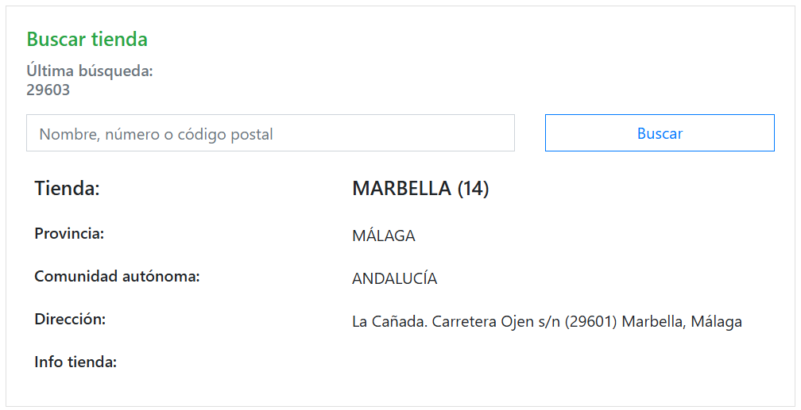
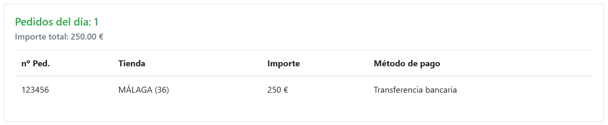
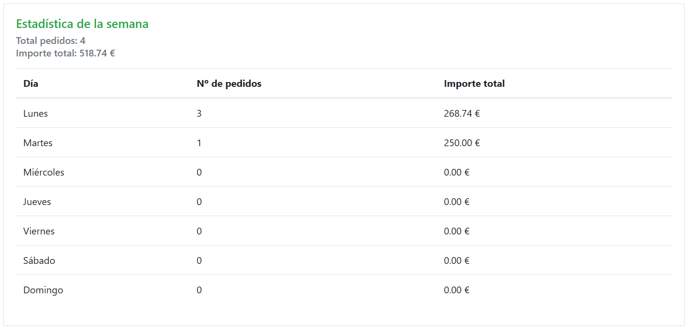
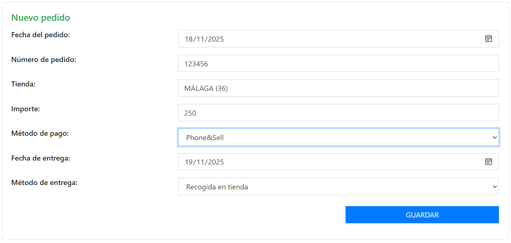
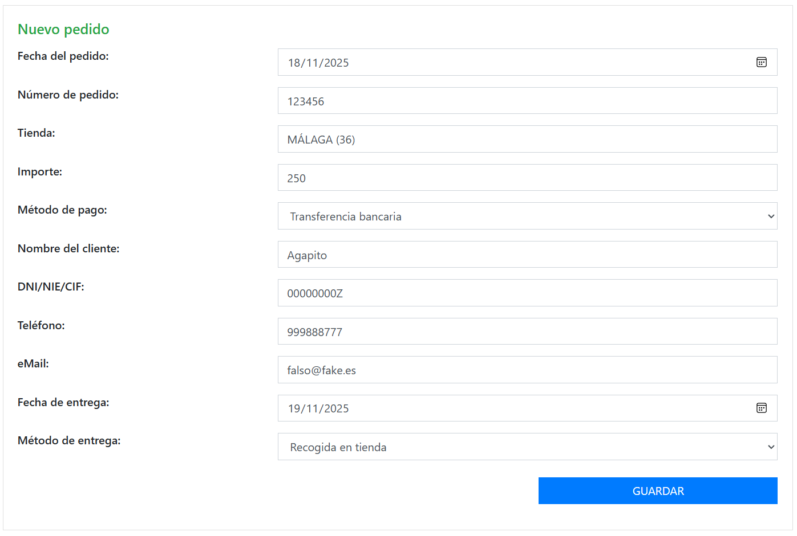

# VAD Admin [Discontinuada]

Aplicación creada durante el período de venta telefónica en la pandemia. La creé con el propósito de gestionar los pedidos telefónicos en las diferentes modalidades de envío.

## Motivación

Durante el período de pandemia en 2020 se produjo un parón a nivel mundial que hizo que muchas empresas tuvieran que adaptarse a una situación insólita. *Leroy Merlin* habilitó el servicio de venta telefónica, que por aquel entonces no existía, y pusieron a muchos de sus vendedores a prestar este servicio. Siendo yo uno de ellos, me encontré realizando ventas a nivel nacional desde casa con un sistema recién implantado y un equipo recién formado.

Los clientes llamaban a una centralita que pasaba la llamada a un vendedor disponible y éste, haciendo uso de la web y de algunas aplicaciones y sistemas que la empresa habilitó, debía localizar la tienda más cercana, realizar el pedido y hacer su seguimiento. También tenía que confeccionar presupuestos para los clientes que los solicitasen.

Para realizar el pago había varios métodos, cada uno con unos procedimientos diferentes que pasaban por copiar unos datos a una hoja de cálculo compartida en la nube, dar los datos bancarios para realizar una transferencia y más tarde se implantaron distintos métodos de *Phone&Sell* que permitían unos pagos más ágiles.

También había diferentes métodos de entrega de productos: En tienda, o con envío por diferentes canales internos. Cada uno con sus protocolos.

Siendo un sistema todavía en sus primeros días de vida, y con una aplicación interna que aún no estaba adaptada a esta situación resultaba complicado gestionar los pedidos, los métodos de pago y el seguimiento. Además se nos valoraba nuestro trabajo por el importe en pedidos semanales y no había una manera sencilla de ver estos datos por lo que me creé una pequeña aplicación que me ayudara a adminsitrar mi labor.

## La aplicación

El desarrollo fue algo improvisado que comenzó como una hoja de cálculo para llevar algo de control. A esta hoja le añadí algunos scripts para crear menús y, posteriormente, tras profundizar en el entorno de desarrollo de *Google App Script*, comencé el desarrollo de esta versión.

Consta de un *frontend* realizado en **javascript/html** usando como framework **[Bootstrap v4.4.1](https://getbootstrap.com/docs/4.4/getting-started/introduction/)** y **[jQuery v3.5.1](https://api.jquery.com/)**. El *backend* se sustenta en una **hoja de cálculo de google** de la que obtiene los datos necesarios.

### Funcionalidades implementadas

Hay varias páginas para realizar la gestión de los pedidos. La página inicial es un **dashboard** donde se pueden ver los **pedidos realizados**, **presupuestos pendientes**, **estadísticas semanales** de pedidos y donde se pueden buscar **datos de cualquier tienda**. También se puede ver la **disponibilidad de los artículos en las tiendas**, sin embargo, esta funcionalidad se basaba en una API proporcionada por Leroy Merlin que ya no está disponible por haber quedado obsoleta.

#### Dashboard

#### Buscar tienda

Para buscar tienda puede usarse tanto el cuadro desplegable como introducir el código postal del cliente y la aplicación devuelve la tienda más cercana.

#### Pedidos del día

Se pueden ver los pedidos realizados en el día para llevar un control.

Más adelante se podría implementar el acceso a los pedidos para consulta.

#### Estadísticas de la semana

Aquí se ven los pedidos realizados y el importe total de cada día de la semana. Muy útil para poder poner cosas en común con el resto de compañeros de venta telefónica.

#### Nuevo pedido

También hay una página desde donde se pueden **introducir los datos de los pedidos** y guardarlos en la hoja de cálculo.

Dependiendo del tipo de pago empleado, se muestran unas opciones u otras ya que en el caso de la *transferencia bancaria*, por ejemplo, el procedimiento consistía en enviar sendos correos a cliente y tienda para poder cerrar la operación.

Mi idea era aprovechar las capacidades de la **API de Google** para poder automatizar el envío de los correos con los datos correspondientes.

### Otras funcionalidades

La aplicación debía hacer también el **seguimiento de los presupuestos** y mostrar **listas de pedidos y presupuestos** que se pudieran filtrar. Así mismo, debía permitir **configurar los enlaces para las aplicaciones con los métodos de pago** proporcionados por la empresa, realizar **envíos de correos predefinidos** a clientes y departamentos de tienda. Sin embargo, debido a que volví a tienda para continuar con mi trabajo habitual como asesor, la aplicación quedó **discontinuada** y no se implementaron estas funcionalidades.

## Estructura

### Hoja de cálculo

En una única *Hoja de Cálculo de Google* hay que incluir las siguientes pestañas:

- Pedidos
- Tiendas
- Presupuestos
- DIST CP LM

En las tablas de la hoja de cálculo habría que mantener las mismas columnas ya que la aplicación accede a ellas por su letra.

#### Pedidos

La **hoja de pedidos** debe tener la siguiente estructura:

| Columna | Título | Descripción |
|-|-|-|
| A | **Fecha** | Fecha de creación del pedido |
| B | **Pedido** | Número del pedido |
| C | **Tienda** | Tienda desde la que se realiza el pedido |
| D | **Cliente** | Nombre del cliente |
| E | **Teléfono** | Teléfono del cliente |
| F | **Email** | Corre electrónico del cliente |
| G | **DNI/NIE** | Número de identificación del cliente |
| H | **Importe** | Importe total del pedido |
| I | **Pago** | Método de pago |
| J | **Fecha entrega** | Fecha de promesa de entrega |
| K | **Tipo de recogida** | Método en la que el pedido será entregado |
| L | **Estado** | Observaciones |

#### Tiendas

La **hoja de tiendas** tendría la siguiente estructura:

| Columna | Título | Descripción |
|-|-|-|
| A | **Nº de tienda** | Un número para identificar cada tienda. |
| B | **Nombre de tienda** | Nombre de la tienda designada. |
| C | **Comunidad autónoma** | De orígen de la tienda. |
| D | **Para mostrar** | Es un campo calculado que muestra el nombre de la tienda y su número en conjunto. |
| E | **Correo cajas** | Algunos procedimientos de pago incluían el envío de un correo con una información concreta al departamento de cajas de la tienda. Aquí se guardaría esa dirección de envío. |
| F | **Número de cuenta** | El cliente necesitaba el número de cuenta para poder realizar el ingreso por lo que se automatizaría también el envío del correo al cliente con una plantilla. |
| G | **Dirección** | Un enlace a Google Maps para poder visualizar rápidamente la ubicación de la tienda. |
| H | **Info** | Durante la pandemia se añadía información relevante sobre la situación de la tienda en tiempo real. Si se podía acceder, si había algún acceso especial habilitado... |
| I | **Nº de tienda** | Igual que la columna *A*. |
| J | **Provincia** | De la tienda de orígen. |

#### Presupuestos

Presupuestos

#### DIST CP LM

Distancia a las tiendas por código postal.
